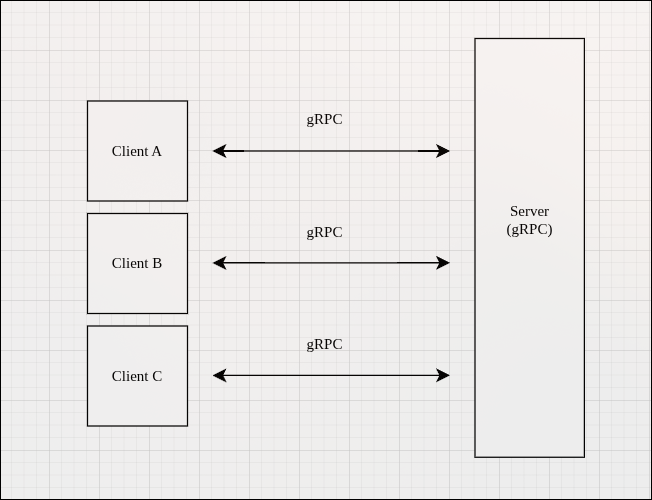
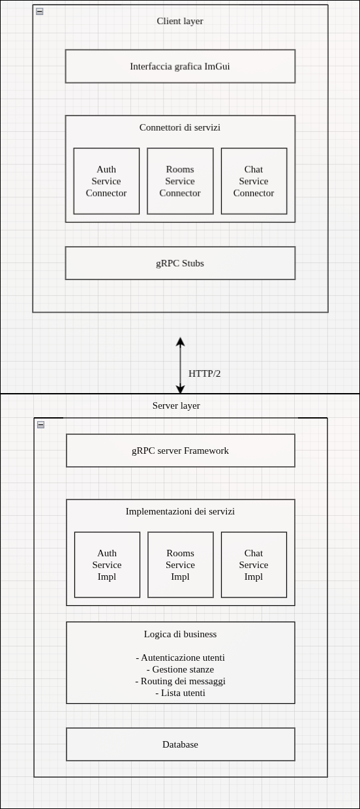
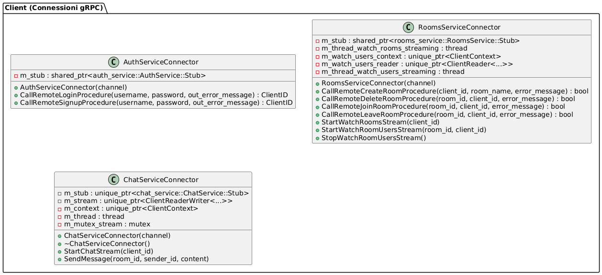
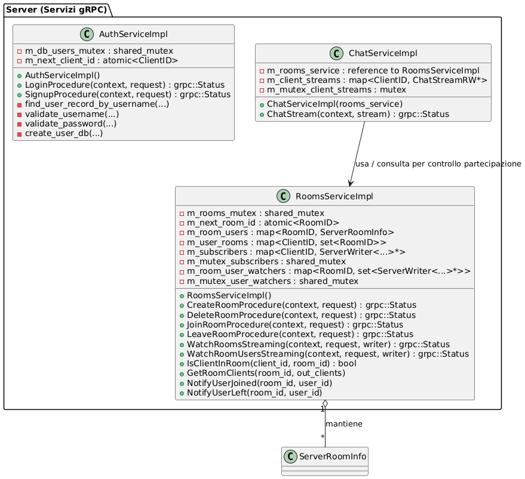
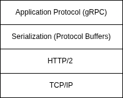
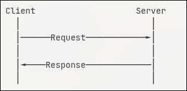
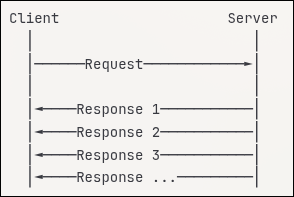
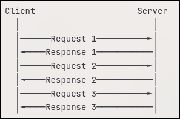
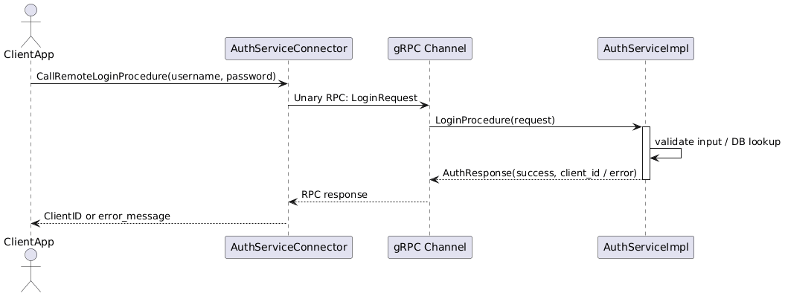
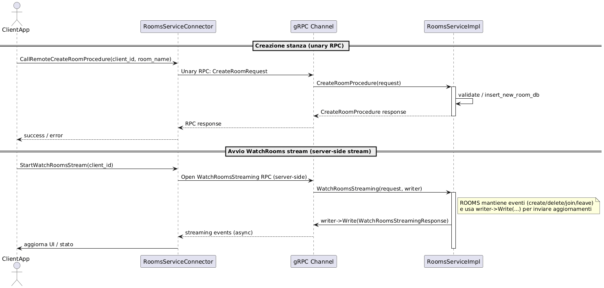

# Introduzione

Il presente documento descrive un sistema di chat distribuita in tempo reale, sviluppato in C++ secondo un'architettura client-server. Il sistema consente la comunicazione multiutente attraverso stanze di chat virtuali, con supporto per autenticazione utente, gestione dinamica delle stanze e messaggistica in tempo reale.

L'implementazione utilizza tecnologie moderne come gRPC per la comunicazione remota, Protocol Buffers per la serializzazione dei dati e ImGui per l'interfaccia grafica client.

L'architettura è stata progettata per garantire scalabilità, affidabilità e aggiornamenti in tempo reale senza ricorso a tecniche di polling.

# Requisiti e funzionalità

## Requisiti funzionali

**RF1: Autenticazione utente**

- Il sistema deve permettere agli utenti di registrarsi fornendo username e password
- Il sistema deve permettere agli utenti registrati di effettuare il login
- Il server deve validare le credenziali degli utenti mediante un database persistente

**RF2: Gestione stanze**

- Gli utenti devono poter creare nuove stanze di chat
- Gli utenti devono poter eliminare solamente le stanze di cui sono creatori
- Gli utenti devono poter entrare e uscire da qualsiasi stanza esistente
- Gli utenti devono poter partecipare contemporaneamente a più stanze
- Il sistema deve visualizzare in tempo reale l'elenco completo delle stanze disponibili
- Il sistema deve mostrare il numero di utenti presenti in ciascuna stanza

**RF3: Gestione utenti nelle stanze**

- Il sistema deve visualizzare in tempo reale la lista degli utenti presenti in una stanza
- Gli aggiornamenti sulla presenza degli utenti devono essere propagati a tutti i partecipanti della stanza

**RF4: Messaggistica**

- Gli utenti devono poter inviare messaggi testuali nelle stanze a cui partecipano
- I messaggi devono essere ricevuti in tempo reale da tutti gli utenti presenti nella stanza
- Ogni messaggio deve includere l'identificativo e il nome del mittente

## Requisiti non funzionali

**RNF1: Scalabilità**

- Il sistema non pone limiti sul numero massimo di utenti per stanza
- L'architettura deve supportare un numero arbitrario di stanze simultanee

**RNF2: Real-time**

- Gli aggiornamenti (messaggi, stato stanze, utenti) devono essere propagati senza ritardi percettibili
- Il sistema deve utilizzare streaming invece di polling per gli aggiornamenti in tempo reale

**RNF3: Affidabilità**

- Il sistema deve gestire correttamente situazioni di disconnessione client
- Le operazioni concorrenti devono essere gestite mediante meccanismi di sincronizzazione thread-safe

## Vincoli architetturali

- Comunicazione esclusivamente client-server (no peer-to-peer)
- Utilizzo di gRPC per tutte le comunicazioni remote
- Implementazione in C++ sia per client che per server
- Utilizzo di Protocol Buffers per la definizione dei servizi e dei messaggi

# Architettura del sistema

## Panoramica

Il sistema adotta un'architettura client-server centralizzata, dove il server funge da coordinatore globale e i client non comunicano mai direttamente tra loro. La comunicazione avviene esclusivamente attraverso chiamate RPC (Remote Procedure Call) implementate con gRPC.

{width=90%}

## Servizi

Il server espone tre servizi gRPC distinti, ciascuno con responsabilità ben definite secondo il principio di separazione delle responsabilità:

**AuthService - servizio di autenticazione**

Gestisce registrazione e login degli utenti.

**RoomsService - servizio di gestione stanze**

Gestisce creazione, eliminazione, accesso alle stanze e streaming degli aggiornamenti.

**ChatService - servizio di messaggistica**

Gestisce il flusso bidirezionale dei messaggi tra client e server.

## Diagramma dell'architettura

La figura seguente illustra l'architettura a livelli del sistema, mostrando la separazione tra client layer e server layer, nonché i componenti principali di ciascuno strato.

{width=80%}

## Diagrammi dei componenti

I seguenti diagrammi mostrano in dettaglio i componenti client e server con le relative classi e relazioni.

**Componenti lato client:**

{width=75%}

**Componenti lato server:**

{width=75%}

# Descrizione dei protocolli

Il sistema utilizza il seguente stack di protocolli:

{width=50%}

Dove:

- **gRPC**: Framework RPC che gestisce chiamate remote, multiplexing, flow control
- **Protocol Buffers**: Meccanismo di serializzazione efficiente e type-safe
- **HTTP/2**: Supporto per streaming bidirezionale, multiplexing, compressione header
- **TCP/IP**: Trasporto affidabile con ritrasmissione automatica

## Tipologie di metodi RPC utilizzati

Il sistema impiega tre diverse modalità di comunicazione RPC:

### Simple RPC (Unary)

Richiesta singola → risposta singola.

Utilizzato per: Login, Signup, Create/Delete/Join/Leave Room.

{width=60%}

### Server-side streaming RPC

Richiesta singola → stream di risposte.

Utilizzato per: WatchRoomsStreaming, WatchRoomUsersStreaming.

{width=60%}

### Bidirectional Streaming RPC

Stream di richieste ↔ Stream di risposte.

Utilizzato per: ChatStream

{width=60%}

## Diagrammi di sequenza

I diagrammi di sequenza seguenti illustrano le interazioni tra client e server per i principali flussi operativi del sistema.

**Flusso di autenticazione (login/signup)**

Il diagramma mostra il processo di autenticazione, dalla richiesta del client fino alla risposta con l'assegnazione del client_id.

{width=75%}

\newpage

**Flusso di creazione e join stanza**

Il diagramma illustra come viene creata una nuova stanza e come gli utenti vi si uniscono, includendo le notifiche ai watchers.

{width=75%}

\newpage

**Flusso di messaggistica bidirezionale**

Il diagramma mostra il flusso bidirezionale dei messaggi tra client attraverso il server, inclusa la registrazione degli stream e il routing dei messaggi.

{width=75%}

## Definizione dei servizi protocol buffers

### AuthService

```protobuf
service AuthService {
  rpc LoginProcedure(AuthRequest) returns (AuthResponse);
  rpc SignupProcedure(AuthRequest) returns (AuthResponse);
}

message AuthRequest {
  string username = 1;
  string password = 2;
}

message AuthResponse {
  uint32 client_id = 1;
}
```

### RoomsService

```protobuf
service RoomsService {
  rpc CreateRoomProcedure(CreateRoomProcedureRequest) 
      returns (CreateRoomProcedureResponse);
  rpc DeleteRoomProcedure(DeleteRoomProcedureRequest) 
      returns (DeleteRoomProcedureResponse);
  rpc JoinRoomProcedure(JoinRoomProcedureRequest) 
      returns (JoinRoomProcedureResponse);
  rpc LeaveRoomProcedure(LeaveRoomProcedureRequest) 
      returns (LeaveRoomProcedureResponse);
  rpc WatchRoomsStreaming(WatchRoomsStreamingRequest) 
      returns (stream WatchRoomsStreamingResponse);
  rpc WatchRoomUsersStreaming(WatchRoomUsersStreamingRequest) 
      returns (stream WatchRoomUsersStreamingResponse);
}
```

### ChatService

```protobuf
service ChatService {
  rpc ChatStream(stream ChatStreamRequest) 
      returns (stream ChatStreamResponse);
}

enum ChatMessageType {
  CHAT_MESSAGE_TYPE_UNSPECIFIED = 0;
  CHAT_MESSAGE_TYPE_REGISTER = 1;
  CHAT_MESSAGE_TYPE_TEXT = 2;
}

message ChatStreamRequest {
  ChatMessageType type = 1;
  uint32 room_id = 2;
  uint32 sender_id = 3;
  string sender_name = 4;
  string content = 5;
}

message ChatStreamResponse {
  uint32 room_id = 1;
  uint32 sender_id = 2;
  string sender_name = 3;
  string content = 4;
}
```

# Considerazioni implementative

## Gestione della concorrenza

### Lato server

- **Shared mutex**: utilizzati per permettere letture concorrenti e scritture esclusive sulle strutture dati condivise (`m_rooms_mutex`, `m_db_users_mutex`, `m_mutex_subscribers`)
- **Atomic operations**: l'assegnazione degli ID (`client_id`, `room_id`) avviene tramite variabili atomiche per garantire unicità senza lock
- **Fine-grained locking**: lock separati per diverse strutture dati per minimizzare la contesa

### Lato client

- **Thread dedicati**: ogni stream (rooms watching, users watching, chat) opera in un thread separato per non bloccare l'interfaccia grafica
- **Mutex per stream**: protezione degli accessi concorrenti agli stream bidirezionali

## Gestione degli stream

### Streaming lato server

- **WatchRoomsStreaming**: mantiene una mappa di subscriber attivi, notificando ogni cambiamento di stato delle stanze
- **WatchRoomUsersStreaming**: mantiene watchers per stanza specifica, notificando entry/exit degli utenti
- **ChatStream**: gestisce un flusso bidirezionale per ogni client, instradando i messaggi ai destinatari appropriati

### Streaming lato client

- Gli stream vengono aperti in thread dedicati che rimangono in ascolto continuo
- Le disconnessioni vengono gestite terminando i thread e rilasciando le risorse
- I context e i reader vengono gestiti tramite `unique_ptr` per garantire RAII

## Propagazione degli aggiornamenti

Il sistema implementa un pattern publish-subscribe per gli aggiornamenti in tempo reale:

1. **Registrazione**: i client si registrano per ricevere aggiornamenti aprendo stream specifici
2. **Notifica**: quando avviene un evento (creazione stanza, nuovo utente), il server itera sui subscriber interessati
3. **Push**: gli aggiornamenti vengono inviati attraverso gli stream attivi senza necessità di polling

## Routing dei messaggi

Il flusso di routing dei messaggi chat segue questi passaggi:

1. Client A invia un messaggio sulla stanza X tramite ChatStream
2. ChatServiceImpl riceve il messaggio e verifica l'appartenenza alla stanza tramite RoomsServiceImpl
3. ChatServiceImpl ottiene la lista di tutti i client nella stanza X
4. Il messaggio viene inoltrato a tutti gli stream attivi dei client presenti nella stanza
5. I client ricevono il messaggio nel loro thread di ricezione dedicato
